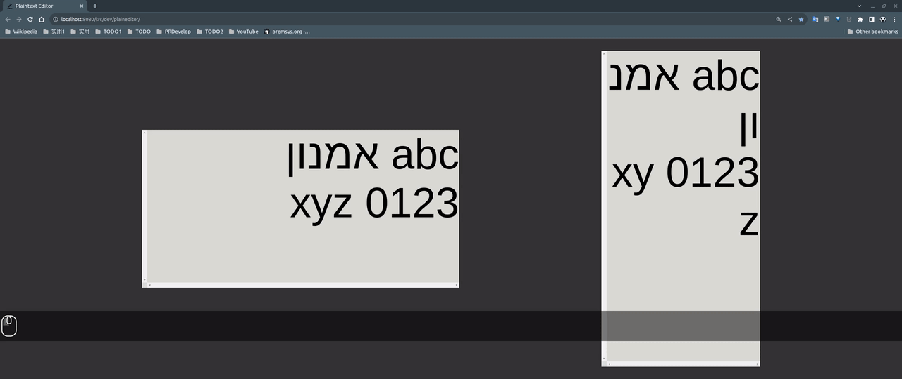
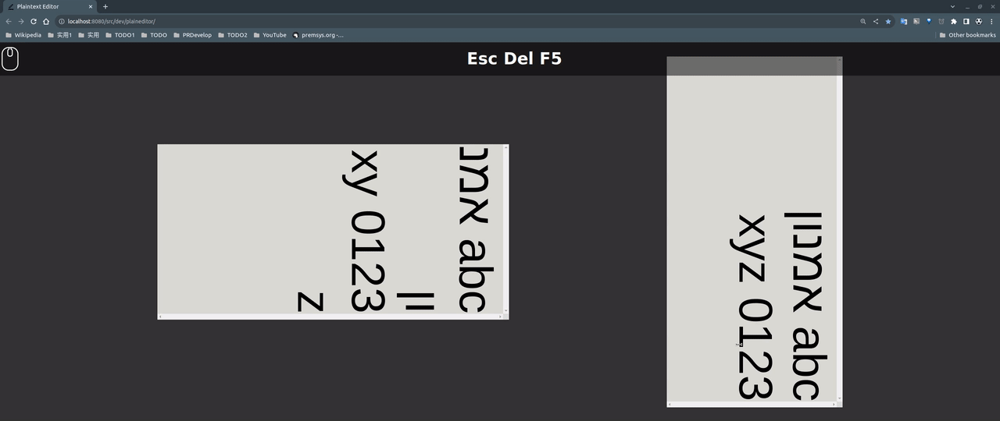
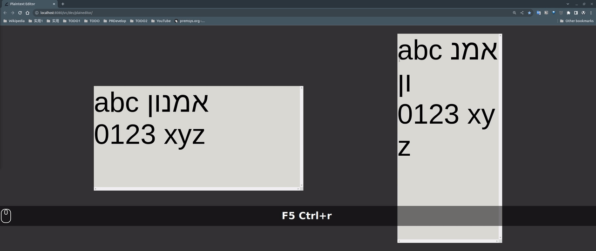
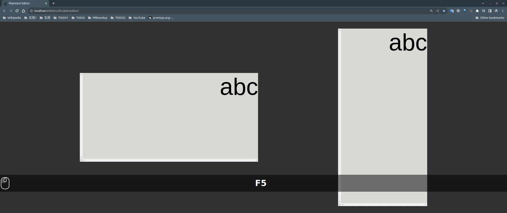
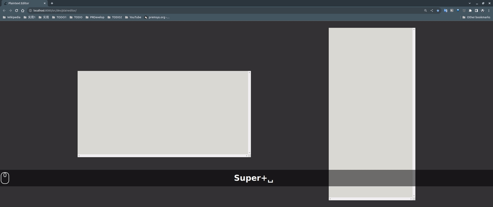

# Welcome to PDF Annotator!

## Plaintext Editor (2023-08-07)

Move caret by visual order of logical order `[..."abc אמנון\n0123 xyz"]`:

Editing:

("אמנון פזי (10 בינואר 1936 - 17 באוגוסט 2006) היה מתמטיקאי ישראלי.")

("枯藤老樹昏鴉\n小橋流水人家 ")

## Multi-window System (2023-06-04)

## Theme Setting (2023-02-15)

